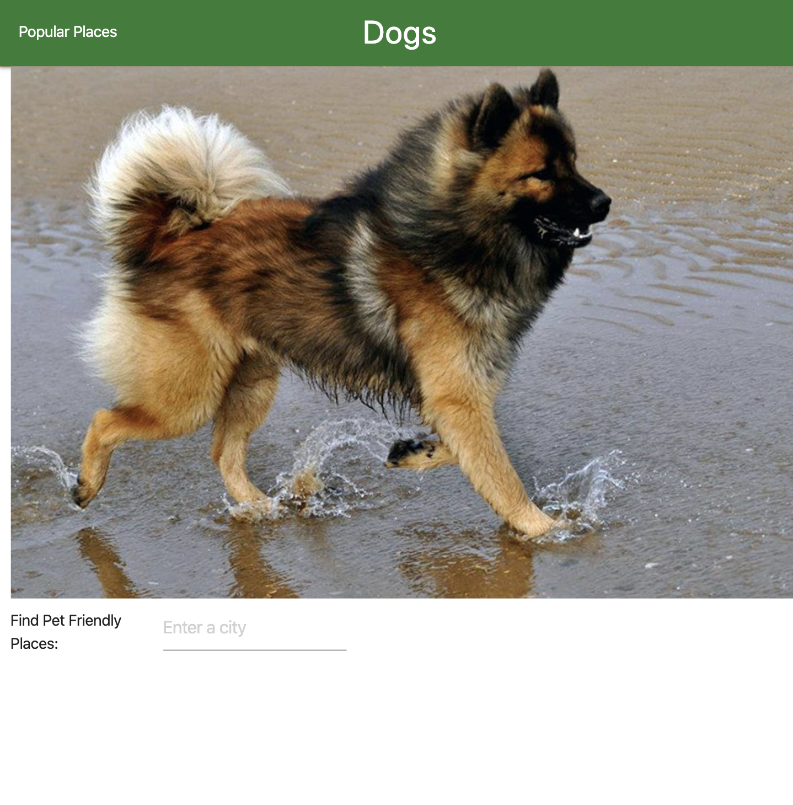

# Find Dog Friendly Places
Can I bring my dog?
 
Made by Letty Bedard, Matt Cheney, Danielle Daley, and Abigail Hoerman.
 
Hosted by GitHub.

## User Story
AS A dog owner
 
I WANT to know where I can take my dog
 
SO THAT I can take my dog with me

## Acceptance Criteria
GIVEN a website with a search bar and a picture of a dog
 
WHEN I search for a city
 
THEN a map appears with flags on it and a list below it

## Description
Say you have just moved somewhere, or even just visiting somewhere new and you want to bring your dog with you. The tough part is figuring out where your four-legged friend is welcome in that city. We created this app to answer those questions. When you search for a city or town in the search bar, an autofill dropdown menu appears. Choose the correct city or town, and a map appears as well as the current weather. Using the Google Places Api and Google Maps Api the map is interactive with little flags where the place is located that are clickable. Below the map there is also a list of the same places with the corresponding alphabetical marker.

Are you planning a trip and can't remember where that dog friendly place was, never fear because we have created a recent searches list to remind you of where the last places you searched were. The list is saved in your local storage so you can leave the page at anytime and come back later to search it. When you are done, the CLEAR ALL button will clear your list as well.

## Links
[GitHub Repo](http://github.com)
 
[Live Site](https://danielledaley2196.github.io/DOGS/)

## Screenshot

 

![With List] (/images/list_desktop.png)
 

 

